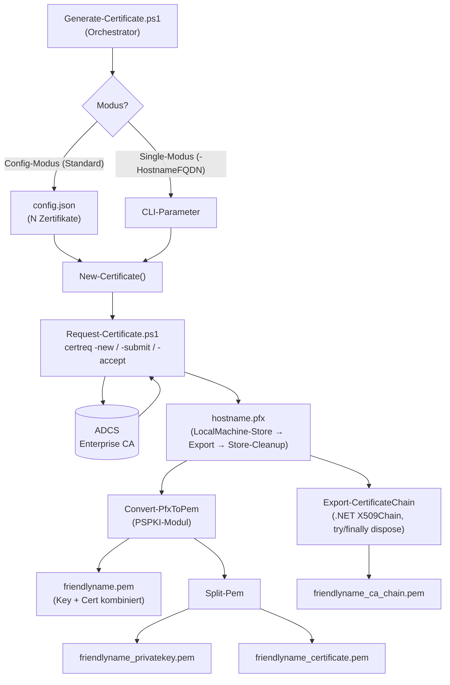
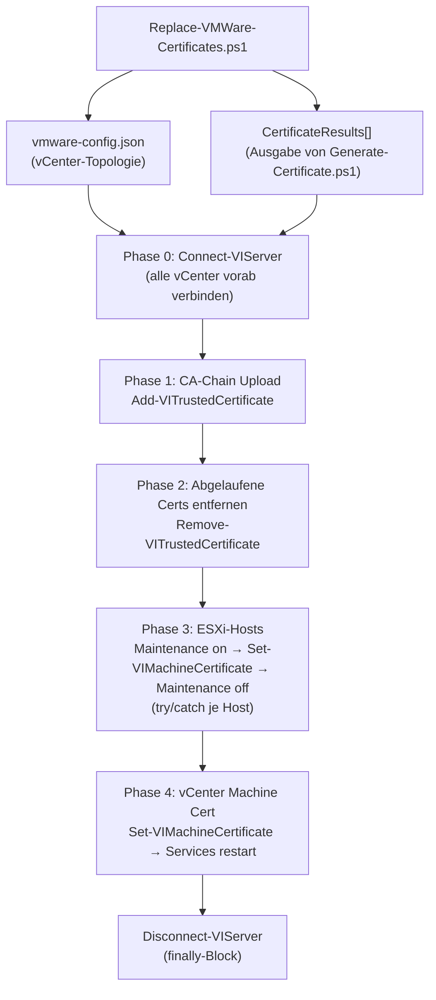
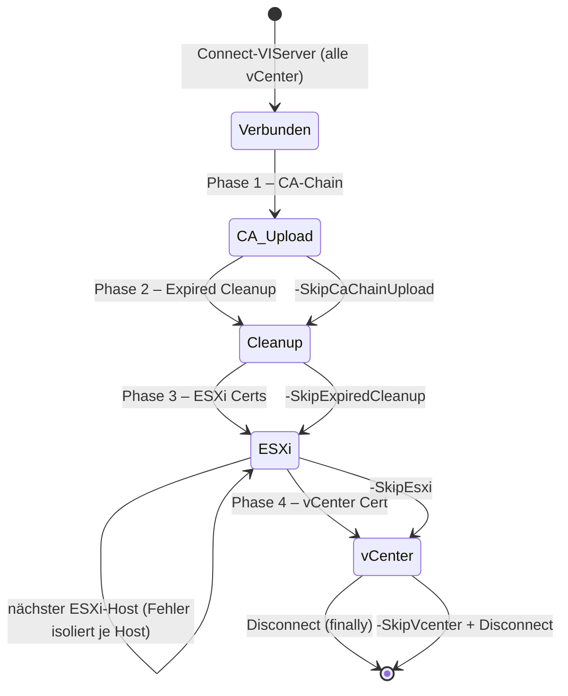
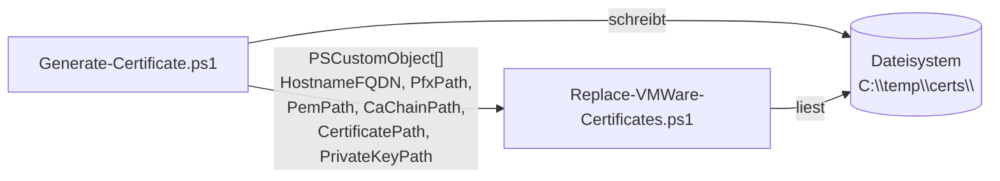

# Architektur-Übersicht – Certificates Toolkit

---

## Stack

| Schicht | Technologie |
|---------|-------------|
| Orchestrierung | PowerShell 7.0+ (`Generate-Certificate.ps1`) |
| Zertifikatsanforderung | `certreq.exe` → ADCS Enterprise CA |
| PFX → PEM | PSPKI-Modul (`Convert-PfxToPem`) |
| Zertifikatsketten-Export | .NET `X509Chain` (inline, kein externes Modul) |
| VMware-Deployment | VMware.PowerCLI (`VMware.VimAutomation.Core`) |
| Konfiguration | JSON-Dateien (`config.json`, `vmware-config.json`) |
| Auth | keine (lokale Maschinenrechte + interaktiver vCenter-Credential-Prompt) |
| Datenbank | keine |
| Build | keine |

---

## Systemstruktur – Zertifikatsgenerierung



---

## Systemstruktur – VMware-Deployment



---

## VMware-Deployment: Phasenfolge und Skip-Optionen



---

## Modul-Verantwortlichkeiten

```
Generate-Certificate.ps1          → Orchestrierung: Config/CLI lesen, New-Certificate() aufrufen, PSCustomObject-Ergebnisse zurückgeben
Request-Certificate.ps1           → ADCS-Anfrage via certreq.exe, PFX-Export aus LocalMachine-Store, Store-Cleanup
Replace-VMWare-Certificates.ps1   → Phasiertes Cert-Deployment auf vCenter/ESXi via PowerCLI
Export-CertificateChain()         → CA-Kette aus PFX via .NET X509Chain extrahieren und als PEM schreiben
Split-Pem()                       → Kombinierten PEM (Key + Cert) in zwei separate Dateien aufteilen
Initialize-Module()               → PSPKI-Modul bei Bedarf installieren und importieren
Resolve-Param()                   → CLI-Parameter gegen Script-Defaults auflösen (Single-Modus)
Get-PropertyOrDefault()           → JSON-Objekt-Property gegen Config-Defaults auflösen (Config-Modus)
Find-CertResult()                 → PSCustomObject für einen Hostnamen aus CertificateResults[] suchen
Read-CertFiles()                  → Cert- und Key-PEM-Inhalte aus Dateipfaden im CertResult lesen
```

---

## Datenfluss – Übergabe zwischen den Skripten



---

## Entscheidungsrelevante Constraints

| Constraint | Auswirkung |
|-----------|-----------|
| Windows-only (`certreq.exe`, LocalMachine-Store) | Nicht auf Linux/macOS ausführbar |
| Admin-Rechte erforderlich | `certreq.exe` schreibt in LocalMachine-Store |
| ADCS Enterprise CA erreichbar | Kein Offline-CA- oder Standalone-CA-Support |
| vCenter **zuletzt** ersetzen | `Set-VIMachineCertificate` auf vCenter löst Services-Restart aus → API-Verbindung bricht |
| ESXi in Maintenance-Modus | Zertifikatstausch auf laufendem Host nicht möglich |
| PSPKI-Modul | Wird auto-installiert; erfordert Internetzugang oder lokal verfügbares Modul |
| Einzel-CA-Annahme | `Replace-VMWare-Certificates.ps1` lädt nur eine CA-Chain (die aus `CertificateResults[0]`); Warnung bei mehreren distinct Pfaden |
